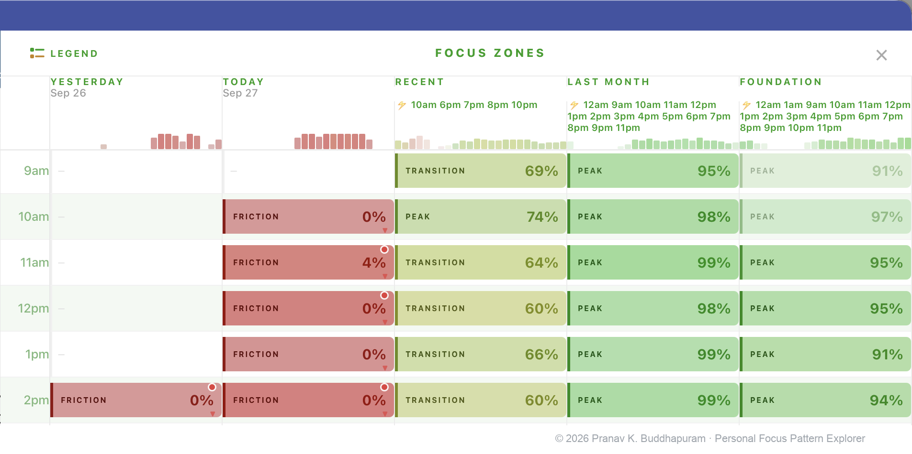
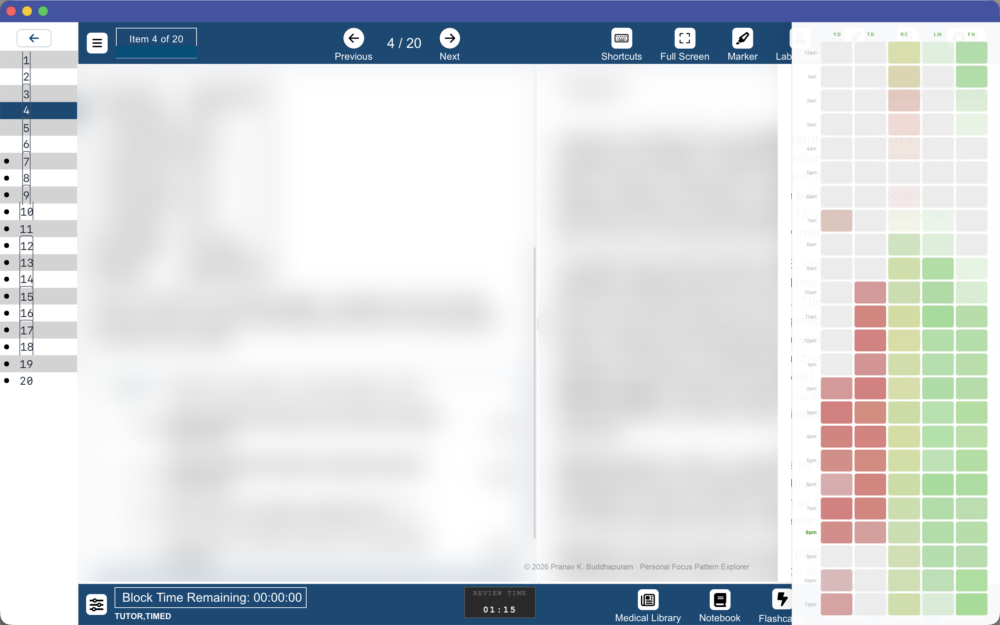

# Personal Focus Pattern Explorer

### Time-of-day behavioral visualization for sustained USMLE preparation

*RescueTime API integration · productivity-pattern interpretation · AI-assisted software development*

> **Portfolio case study. Source code and implementation details are intentionally private.**

Personal Focus Pattern Explorer is a browser-based study-analytics tool I developed during dedicated USMLE preparation to transform my own computer-activity history into a visual picture of **when sustained focused work tended to occur — and when weaker or more interrupted patterns tended to take over**.

I was already using RescueTime to measure activity and distraction-blocking tools to protect study time. What I still lacked was an **interpretation layer**: something that could turn accumulated behavioral data into a practical answer to one recurring question:

**Which parts of my day consistently supported sustained, focused work, and which did not?**

  

*Selected time-of-day view comparing recent behavior with longer-term personal patterns. The original interface used the internal working title “Focus Zones.”*

> Screenshots reflect my own real study data rather than demonstration content. Detailed scoring and interpretation logic are intentionally not shown.

---

## At a Glance

- **Time-of-day pattern visualization** — turns activity history into an immediately readable hourly view
- **Current vs. historical comparison** — places recent behavior beside longer-term personal baselines
- **Continuity-aware interpretation** — distinguishes sustained productive activity from highly interrupted work
- **Visual trend cues** — makes recurring stronger and weaker periods easier to recognize
- **Real study use** — developed and repeatedly refined during dedicated USMLE preparation
- **Private implementation** — scoring, thresholds, weighting, and detailed interpretation logic remain unpublished

---

# Why I Built This

During USMLE preparation, I was already using **RescueTime's paid plan** to measure my computer activity.

It gave me detailed records of how time was being spent, allowed applications and websites to be categorized by productivity, and supported alerts that helped keep productive and distracting activity visible.

I was also using distraction-blocking tools such as **Cold Turkey** and **Micro Manager** to make the study environment harder to escape from during dedicated work periods.

So I already had two useful layers:

**Measurement** — RescueTime showed what happened.  
**Enforcement** — blocking tools helped prevent behaviors I wanted to avoid.

What I still lacked was **interpretation**.

I would review the previous day and decide that I should structure the next morning differently, but those intentions were easy to lose when they remained abstract. I wanted something concrete enough to help answer questions such as:

- At what times of day had focused work been most consistent?
- Was today's pattern improving or deteriorating relative to my own history?
- Which periods were worth actively protecting from distraction?
- Were apparently productive periods actually sustained, or repeatedly interrupted?

The goal was never to claim that the software measured biological circadian rhythm or a scientifically validated “flow state.” It visualized **patterns in my own recorded behavior** so that I could make better decisions about how to structure the next study period.

---

# From Tracking to Interpretation

The tool uses my own activity data from the **RescueTime API** and converts it into a comparative, hour-by-hour visual representation of time-of-day behavioral patterns.

The interface was designed to make several things quickly visible:

- **Recurring stronger periods** — hours where productive behavior remained comparatively consistent over time
- **Recurring weaker periods** — time blocks repeatedly associated with lower continuity or more distracting activity
- **Current vs. historical behavior** — whether the present day resembled or diverged from longer-term patterns
- **Changing patterns over time** — whether particular parts of the day appeared to be strengthening or weakening

One of the ideas that became important during development was that **productive time and focused time are not always the same thing**.

A long period spent entirely inside applications classified as productive can still represent a very different experience when attention is constantly moving between tools. The system therefore considers continuity alongside productive activity rather than relying only on raw duration.

The public screenshots show only the **output layer** of this system.

The scoring model, thresholds, historical weighting, confidence logic, and detailed interpretation rules are intentionally kept private.

---

## Used Inside the Real Study Environment

  

*The compact pattern view running alongside my actual Q-bank study workflow. Proprietary educational content has been intentionally obscured.*

A compact view allowed the visualization to remain available while I was studying rather than requiring me to leave the task and open a separate analytics dashboard.

That mattered because the useful moment was often not at the end of the week.

It was **before deciding how to use the next few hours**.

---

# How It Evolved

The project developed gradually through real use rather than from a fixed product specification.

<strong>Development progression</strong>

 

**Early visualization**  
The first goal was simply to make hourly activity patterns easier to see.

**Historical comparison**  
Single-day data was not enough, so the interface evolved to place recent behavior beside longer-term personal patterns.

**Focus quality and continuity**  
Raw productive duration was supplemented by a broader interpretation of whether work appeared sustained or repeatedly interrupted.

**Visual refinement**  
Color, visual emphasis, trend cues, compact views, and comparative states were repeatedly adjusted to make patterns readable at a glance.

**Interactive comparison**  
Later iterations introduced richer ways of comparing time periods and identifying recurring stronger or weaker windows.

**Reliability and edge cases**  
Daily use exposed problems involving asynchronous data loading, rendering order, state handling, precision, navigation, and interface behavior. These were repeatedly corrected as the tool matured.

The source went through **dozens of revisions**, with many changes driven by problems that only became visible during everyday use.

---

# Technical Snapshot

| Aspect | Detail |
| --- | --- |
| **Platform** | Browser-based JavaScript userscript |
| **Data source** | RescueTime API using my own activity data |
| **Interface** | Persistent compact and expanded visualization views |
| **Core purpose** | Time-of-day behavioral pattern interpretation |
| **Development approach** | AI-assisted implementation with repeated real-world testing |
| **Source availability** | Private |

Detailed implementation architecture is intentionally omitted.

---

# Built Through Iteration

This project was developed through an **AI-assisted software development workflow**.

I identified the problem, defined the desired behavior and interface concepts, developed the interpretation model, and specified how the information should be presented.

I then used AI coding systems — particularly **Gemini and Claude** — to generate and revise JavaScript implementations, which I repeatedly tested against my own real activity data during study.

My role centered on:

**problem identification → concept design → specification → AI-assisted implementation → testing → failure detection → debugging direction → validation → refinement**

I do not present the project as software written manually line by line.

What I am showcasing is the process of turning a personal behavioral problem into a working analytical tool through **system thinking, AI-assisted development, repeated testing, debugging, and sustained refinement**.

---

# Author

**Pranav Krishna Buddhapuram, MS Orthopaedics**  
Orthopaedic surgeon · AI-assisted software development and study analytics  
GitHub: [@doctorpranavb](https://github.com/doctorpranavb)

---

# Project Status & Intellectual Property

This repository is a **portfolio and demonstration case study**.

The working source code, scoring model, classification thresholds, weighting system, detailed interpretation logic, and implementation architecture are intentionally kept private.

The screenshots and descriptions demonstrate the purpose, visual design, development process, and capabilities of the system without publishing the information required to reproduce it.

No license is granted for reuse, redistribution, derivative implementation, or commercial use.

This is an independent personal project built using my own RescueTime activity data and API access. RescueTime provides the underlying activity-tracking data; this project is my independent interpretation and visualization layer. It is not affiliated with, sponsored by, or endorsed by RescueTime, Cold Turkey, Micro Manager, or any other third-party service mentioned.

---

**© 2026 Pranav Krishna Buddhapuram. All rights reserved.**
